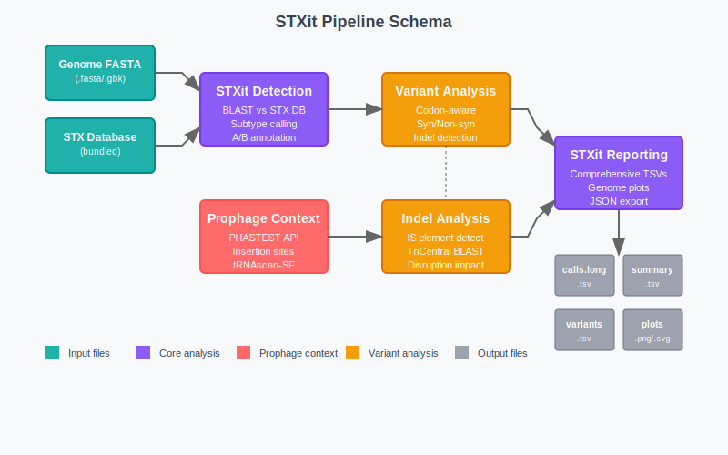

# STXit v1.0.3

**Shiga Toxin Detection and Analysis Pipeline**

STXit is a comprehensive bioinformatics tool for detecting, typing, and analyzing Shiga toxin genes in bacterial genomes with prophage context analysis.



## Pipeline Overview

STXit provides end-to-end analysis of Shiga toxin genes through:

- **STX Detection**: BLAST-based detection against comprehensive STX database (11 subtypes, A/B subunits)
- **Prophage Context**: Integration with PHASTEST for prophage detection and insertion site analysis
- **Variant Analysis**: Codon-aware variant calling with synonymous/non-synonymous classification
- **Indel Analysis**: IS element detection with TnCentral BLAST and disruption impact assessment
- **Comprehensive Reporting**: Detailed TSV outputs, genome plots, and JSON exports

## Installation

| Option | Best for | Installation |
|--------|----------|-------------|
| **A. Conda (local)** | HPC, Mac, Linux — full control, fastest runtime | `conda env create -f environment.yml` |
| **B. Dev Container / Codespaces** | VS Code users, reproducible environments | Open in VS Code → Reopen in Container |
| **C. Docker** | Servers, CI/CD pipelines, containers | `docker build -t stxit .` |

### Option A: Conda Installation

```bash
git clone https://github.com/kramppe/STXit.git
cd STXit
conda env create -f environment.yml
conda activate stxit
pip install -e .
```

**Dependencies installed automatically:**
- BLAST+ 2.14.0
- tRNAscan-SE 2.0.12 (installed automatically)
- IQ-TREE 2.2.0
- Python packages (BioPython, matplotlib, pandas, etc.)

### Option B: Dev Container / Codespaces

**VS Code Dev Container** (requires Docker Desktop):
1. Open STXit folder in VS Code
2. Click "Reopen in Container" when prompted
3. Environment builds automatically with all dependencies

**GitHub Codespaces** (zero local install):
1. Go to https://github.com/kramppe/STXit
2. Click green "Code" button → "Codespaces" → "Create codespace"
3. Full environment runs in browser

### Option C: Docker

```bash
# Build container
docker build -t stxit .

# Run with data mounts
docker run -it --rm \
  -v /path/to/genomes:/data/input \
  -v /path/to/results:/data/output \
  stxit --genome /data/input/genome.fasta --output /data/output
```

## Quick Start

```bash
# Basic STX detection
stxit --genome EC4115.fasta --output results/

# With prophage analysis
stxit --genome EC4115.fasta --output results/ --run-phastest

# Full analysis with tRNA scanning
stxit --genome EC4115.fasta --output results/ --run-phastest --run-trna

# Custom database
stxit --genome genome.fasta --stx-db custom_stx.fasta --output results/
```

## STX Reference Database

STXit includes a comprehensive reference database covering all established STX subtypes:

| Family | Subtypes | A subunits | B subunits | Total sequences |
|--------|----------|------------|------------|----------------|
| **Stx1** | stx1a, stx1c, stx1d | 3 | 3 | 6 |
| **Stx2** | stx2a, stx2b, stx2c, stx2d, stx2e, stx2f, stx2g, stx2h | 8 | 8 | 16 |
| **Total** | **11 subtypes** | **11 sequences** | **11 sequences** | **22 sequences** |

**Database sources:**
- Scheutz et al. (2012) nomenclature standards
- NCBI protein database with verified accessions
- Both A (enzymatic) and B (binding) subunit references

All databases are **downloaded and indexed automatically** during installation. No manual database setup required.

## Test Data

The following test case validates STXit installation and provides expected outputs:

### EC4115 Reference Genome

**Download test genome:**
```bash
# Option 1: NCBI Datasets (recommended)
datasets download genome accession NC_011353.1 --include gff3,rna,cds,protein,genome,seq-report

# Option 2: Direct download
wget -O EC4115.fasta "https://eutils.ncbi.nlm.nih.gov/entrez/eutils/efetch.fcgi?db=nucleotide&id=NC_011353.1&rettype=fasta"
```

**Run test analysis:**
```bash
# Auto mode (recommended)
stxit --genome EC4115.fasta --output test_results/ --run-phastest --run-trna

# Manual mode (faster, for testing)
stxit --genome EC4115.fasta --output test_results/
```

**Expected Results:**

| Locus | Position | Subtype | Identity | Status |
|-------|----------|---------|----------|---------|
| STX_001 | 2,696,202–2,697,442 (−) | stx2c | 100.0% | Exact match |
| STX_002 | 3,271,007–3,272,247 (−) | stx2a | 99.9% | Subtype-like variant |

**stx2a variants:** 11 differences vs canonical (EDL933, X07865):
- 6 synonymous (silent mutations)
- 5 non-synonymous: V971A • F1009L • S1085L • W1097L • P1099T
- No stop codons introduced

**Output files generated:**
- `stx_calls.long.tsv` — Detailed STX calls with annotations
- `stx_summary.tsv` — Concise summary table  
- `stx_variant_differences.tsv` — Per-residue variant analysis
- `stx_genome_linear.png/svg` — Linear genome map
- `stx_results.json` — Machine-readable export

## Command Line Options

```bash
stxit --help
```

**Required:**
- `--genome/-g` — Input genome (FASTA/GenBank)
- `--output/-o` — Output directory

**Analysis Options:**
- `--run-phastest` — Run PHASTEST prophage detection
- `--run-trna` — Run tRNAscan-SE insertion site analysis
- `--phastest-results` — Use pre-computed PHASTEST results
- `--trna-results` — Use pre-computed tRNAscan-SE results

**Database Options:**
- `--stx-db` — Custom STX database (default: bundled)

**Parameters:**
- `--min-identity` — BLAST identity threshold (default: 80.0%)
- `--min-coverage` — BLAST coverage threshold (default: 70.0%)
- `--threads/-t` — CPU threads (default: 4)

**Output Options:**
- `--prefix` — Output filename prefix (default: "stx")
- `--no-plots` — Skip genome visualization
- `--quiet/-q` — Minimal output

## Output Files

### Primary Results

**`stx_calls.long.tsv`** — Comprehensive STX locus calls
- Genomic coordinates, strand, subtype
- Reference/query annotations (A/B subunits)
- Protein accessions and products
- Variant counts and prophage context

**`stx_summary.tsv`** — Concise overview
- Locus ID, subtype, coordinates  
- Identity percentage and match status
- Prophage association (True/False)

**`stx_variant_differences.tsv`** — Detailed variant analysis
- Position-level differences vs reference
- Codon changes and amino acid impacts
- Synonymous vs non-synonymous classification

### Optional Analyses

**`stx_indel_report.tsv`** — Indel analysis (when large insertions detected)
- Insertion/deletion coordinates and sequences
- IS element identification via TnCentral BLAST
- Functional impact assessment (stxA/stxB/intergenic)

**Genome plots:**
- `stx_genome_linear.png/svg` — Linear chromosome map
- `stx_genome_circular.png/svg` — Circular map (large chromosomes)

**`stx_results.json`** — Machine-readable export for integration

## Database Versions

STXit tracks reference database versions for reproducibility:

| Database | Version | Date | Release Page |
|----------|---------|------|--------------|
| STX References | 1.0.3 | 2026-04-16 | [GitHub Releases](https://github.com/kramppe/STXit/releases) |
| TnCentral | 431_seqs | 2026-04-15 | [TnCentral](http://tncentral.ncc.unesp.br/) |

Database version information is recorded in `databases/db_versions.txt` after installation.

## Citation

If you use STXit in your research, please cite:

```bibtex
@software{stxit2026,
  title = {STXit: Shiga Toxin Detection and Analysis Pipeline},
  version = {1.0.3},
  year = {2026},
  url = {https://github.com/kramppe/STXit}
}
```

**STX nomenclature reference:**
Scheutz, F., et al. (2012). Multicenter evaluation of a sequence-based protocol for subtyping Shiga toxins and standardizing Stx nomenclature. *Journal of Clinical Microbiology*, 50(9), 2951-2963.

## Support

- **Issues & Bug Reports**: [GitHub Issues](https://github.com/kramppe/STXit/issues)
- **Documentation**: [README.md](https://github.com/kramppe/STXit/blob/main/README.md)
- **Discussions**: [GitHub Discussions](https://github.com/kramppe/STXit/discussions)

## License

MIT License. See [LICENSE](LICENSE) for details.

---

**STXit Development Team** | stxit@tool.dev | https://github.com/kramppe/STXit
